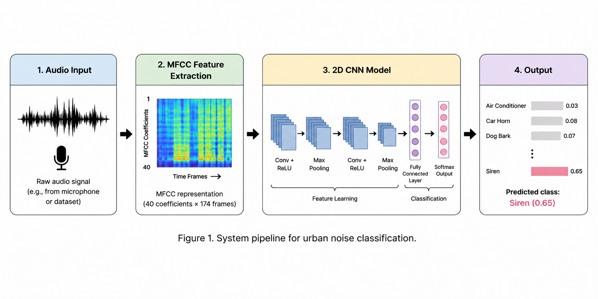
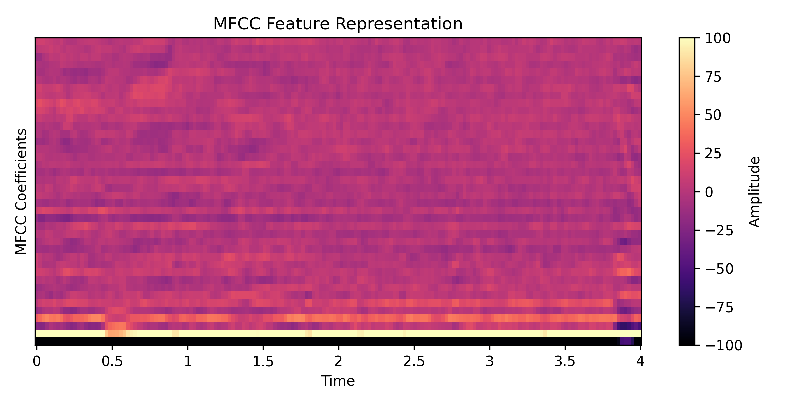
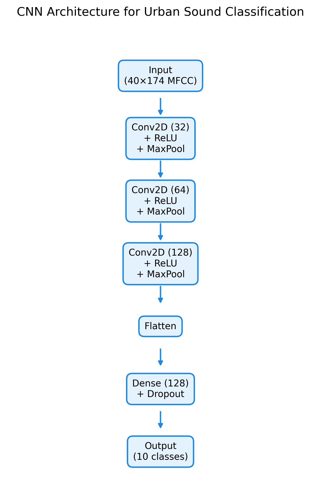
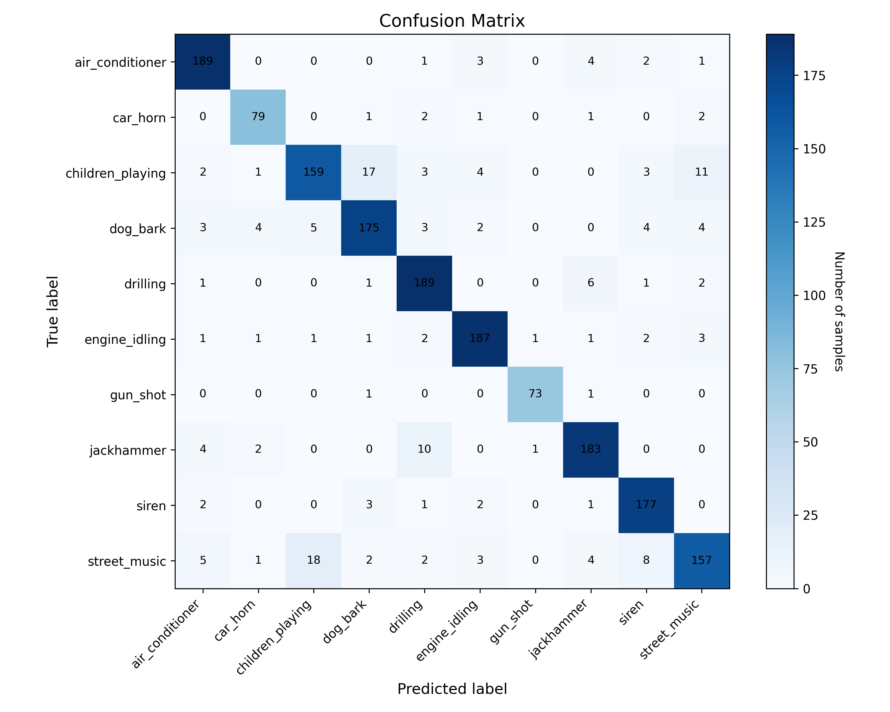
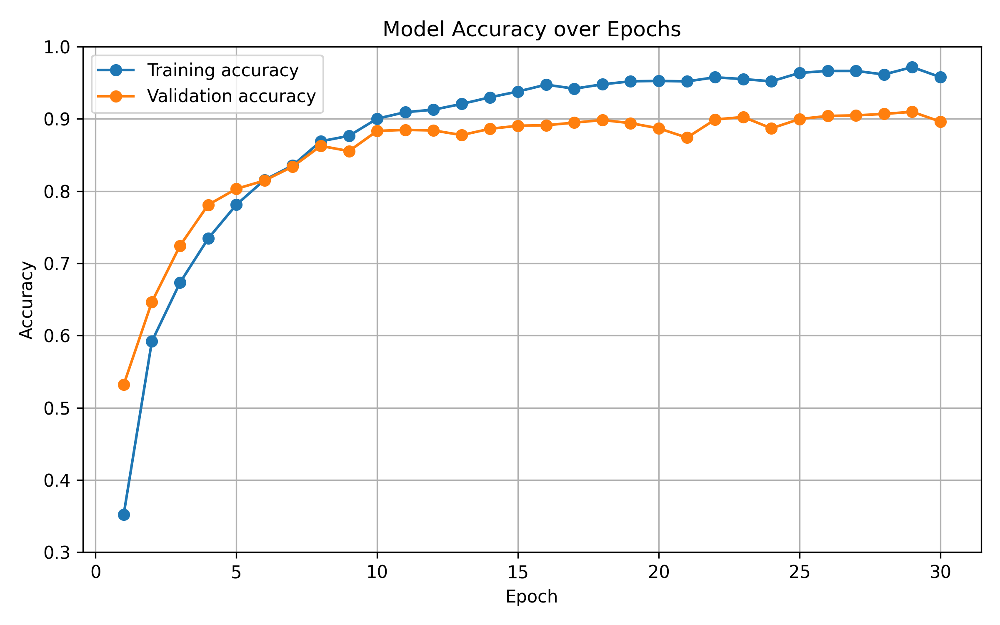

# Low-cost Urban Noise Classification using Edge AI

SPBZ0
GitHub: https://github.com/yushuhanchi/SPBZ0

## Introduction
This project takes a different approach and tests whether a simple system can still work well using a basic microphone, such as one in a mobile phone, together with a lightweight machine learning model. This fits the idea of TinyML, where machine learning models are designed to run on small and low-power devices (Warden, 2018). Urban environments contain many types of noise, including traffic, construction, and human activity. These sounds matter because they affect daily life and reflect how cities function. In recent years, sensor-based systems have been used more often in smart city projects, but many of these systems rely on expensive hardware and complex infrastructure, which makes them difficult to scale. This project takes a different approach and tests whether a simple system can still work well using a basic microphone, such as one in a mobile phone, together with a lightweight machine learning model. The project builds on earlier work in environmental sound recognition and uses the UrbanSound8K dataset, which provides labelled audio clips across different urban sound classes (Salamon et al., 2014). This allows model development without collecting new data. The aim of this project is to design and evaluate a complete workflow for audio classification, including feature extraction, model training, and performance evaluation. The focus is on understanding each step clearly and building a system that is simple, practical, and effective.

## Application Overview

**Figure 1.** Overall workflow of the urban sound classification system, including audio input, MFCC feature extraction, CNN-based classification, and output prediction.

The system uses a simple audio sensing and classification pipeline. The input is audio data that represents what a microphone would capture in an urban environment. In practice, this can come from a mobile phone or another low-cost device. In this project, the audio is taken from a public dataset rather than recorded in real time (Salamon et al., 2014). The audio signals are converted into Mel-frequency cepstral coefficients (MFCCs), which describe key frequency patterns in sound (Davis and Mermelstein, 1980). These features are then used as input to a convolutional neural network. The model processes the features and predicts a sound category, such as traffic or human activity. Edge AI is useful in this type of system because local processing can reduce data transfer, latency, and privacy risks (Bier, 2020). The workflow also reflects a realistic sensing scenario. A microphone would collect audio continuously, and the data would be split into short segments. Each segment would be processed and classified separately. This allows the system to run in near real time and supports continuous monitoring of urban noise. The structure of the pipeline is simple and modular. This makes it easy to add steps such as noise filtering or data compression before classification when needed.

## Data

**Figure 2.** MFCC representation of an example audio signal from the UrbanSound8K dataset. The horizontal axis represents time, and the vertical axis represents MFCC coefficients. The colour intensity indicates spectral energy distribution.

Lower-order MFCC coefficients show stronger energy patterns, while higher-order coefficients capture finer spectral details (Davis and Mermelstein, 1980). These features provide a compact way to represent audio signals for classification tasks. The project uses the UrbanSound8K dataset as the main data source (Salamon et al., 2014). This dataset contains 8732 labelled audio clips across 10 urban sound classes, such as air conditioner, car horn, children playing, and street music. The dataset is used to simulate audio captured by a microphone in an urban environment. Each audio clip is short, usually less than four seconds, which makes it suitable for classification. The audio data is processed in Python using the librosa library. Each file is loaded at a sampling rate of 22050 Hz and converted into MFCC features. A total of 40 coefficients are extracted for each segment. To keep the input size consistent, the MFCC features are padded or truncated to 174 frames, which gives a fixed shape of (40, 174) for each sample. The data is then standardised using the mean and standard deviation from the training set. This helps avoid data leakage and improves model performance. The dataset is useful, but it also has limits. The recordings are clean and well-labelled, which is not always the case in real environments. In practice, sounds may overlap and recording conditions may change, which can reduce performance. The dataset is also imbalanced. Most classes have about 1000 samples, but some classes, such as car horn and gun shot, have fewer samples. This makes them harder for the model to learn. To reduce this problem, stratified sampling is used during the train-test split so each class keeps a similar proportion. This helps keep training and testing consistent. Data augmentation can be used in future work to improve results for smaller classes. Methods such as adding noise, changing pitch, or stretching time can increase data diversity and improve generalisation.

## Model

**Figure 3.** Architecture of the proposed 2D CNN model for urban sound classification.

A convolutional neural network (CNN) is used for the classification task. CNNs are suitable for this problem because MFCC features can be interpreted as 2D representations of audio signals.

The model uses three convolutional layers with 32, 64, and 128 filters (LeCun et al., 1998). Each layer is followed by a max pooling layer to reduce the size of the feature maps. Dropout is applied after each block to reduce overfitting (Srivastava et al., 2014). After these layers, the feature maps are flattened and passed to a fully connected layer with 128 units. A final softmax layer produces probabilities for the 10 sound classes (Goodfellow et al., 2016). The model is kept simple so it can balance performance and computational cost. In practical implementation, this matches the softmax activation function used in TensorFlow/Keras, which converts model outputs into a probability distribution across classes (TensorFlow, 2024). This makes it suitable for deployment on edge devices with limited resources. The use of dropout helps the model learn more robust features by randomly deactivating neurons during training. Small convolutional filters are also used. These filters capture local patterns in the MFCC input, such as short-term frequency changes. Stacking several convolutional layers allows the model to learn more complex patterns step by step. The final dense layer maps these features to class probabilities, and the softmax function ensures that the outputs form a valid probability distribution.

## Experiments

**Figure 4.** Confusion matrix of the CNN model on the UrbanSound8K test set. Most classes are correctly classified, as indicated by strong diagonal values. Misclassifications are mainly observed between acoustically similar classes such as *children_playing* and *street_music*.

**Figure 5.** Training and validation accuracy over epochs. The model shows steady improvement during training and converges after approximately 20 epochs, with validation accuracy stabilising around 90%, indicating good generalisation performance.

Several experiments were carried out to test the performance of the model. The dataset was split into training and testing sets using a stratified method, with 6985 samples for training and 1747 samples for testing. The model was trained for 30 epochs using the Adam optimizer and categorical cross-entropy loss (Kingma and Ba, 2015). Optimizers are important in neural network training because they update model weights to reduce loss during training (Doshi, 2019). The training accuracy increased from about 35% in the first epoch to over 95% in later epochs. The validation accuracy reached around 90% and then remained stable. The final model achieved a test accuracy of 89.8% with a loss of 0.40. This is a clear improvement compared to the baseline 1D CNN model, which reached only 58.6%. The model performance was also measured using precision, recall, and F1-score. Most classes achieved high F1-scores above 0.90. For example, gun_shot reached 0.97 and engine_idling reached 0.93. Lower scores were observed for children_playing and street_music, both around 0.83. These classes are more difficult because their sounds are more variable and often overlap. The confusion matrix shows that most errors happen between classes with similar acoustic patterns.

## Results and Observations
The results show that the model can classify urban sounds with high accuracy. The improved 2D CNN model performs much better than the baseline model, which shows that model design has a strong effect on performance. Sounds with clear and stable patterns are easier to classify. For example, gun_shot and siren are recognised with high accuracy because they have strong and distinct frequency features. Some classes are harder to classify. Children_playing and street_music show lower scores because these sounds are more variable and often include overlapping sources. The dataset also affects the results. UrbanSound8K provides clean and well-labelled samples (Salamon et al., 2014). Real environments are more complex, so performance may drop when the model is used outside this dataset. The training results also show slight overfitting. The training accuracy continues to increase after about 20 epochs, while validation accuracy does not improve much. This suggests that methods such as early stopping or data augmentation could help improve generalisation. The system still shows a complete workflow. It takes audio data, extracts features, trains a model, and produces predictions. This shows that a low-cost sensing approach can work for basic urban sound classification. Future work can test the model with real recordings and try to run it on mobile or edge devices.

## Conclusion
This project focuses on edge AI and shows how a lightweight model can be used for urban sound classification. The model is designed to be simple and efficient, so it can run on low-cost devices without relying on cloud systems. This is important for building scalable sensing systems. Edge deployment also brings clear benefits. It reduces delay, improves data privacy, and avoids constant data transfer (Shi et al., 2016). At the same time, it creates limits because devices have less computing power and limited energy. These constraints are common in TinyML and edge AI systems, where model size, memory use, and energy cost need to be considered before deployment (Hymel et al., 2023). The system design needs to balance performance and efficiency. The results show that a lightweight CNN model combined with MFCC features can achieve high accuracy in a controlled setting. The project shows how audio data can be processed, how a model can be trained, and how predictions can be made. However, real environments are more complex. Noise conditions can change, and multiple sounds may overlap. This can reduce performance outside the dataset. Future work should test the model with real recordings and improve the design for edge deployment.

## Bibliography
*If you added any references then add them in here using this format:*

1. Warden, P. (2018). Why the future of machine learning is tiny. Available at: https://petewarden.com/2018/06/11/why-the-future-of-machine-learning-is-tiny/ [Accessed 1 May 2026].

2. Salamon, J. (2014). A dataset and taxonomy for urban sound research. New York: ACM Multimedia, pp. 1041–1044. https://urbansounddataset.weebly.com/urbansound8k.html

3. TensorFlow (2024). Module: tf.keras.activations. Available at: https://www.tensorflow.org/api_docs/python/tf/keras/activations [Accessed 1 May 2026].

4. Davis, S. (1980). Comparison of parametric representations for monosyllabic word recognition in continuously spoken sentences. New York: IEEE Transactions on Acoustics, Speech, and Signal Processing, pp. 357–366. https://ieeexplore.ieee.org/document/1163420

5. Bier, J. (2020). AI and vision at the edge. EE Times. Available at: https://www.eetimes.com/ai-and-vision-at-the-edge/ [Accessed 1 May 2026].

6. LeCun, Y. (1998). Gradient-based learning applied to document recognition. New York: Proceedings of the IEEE, pp. 2278–2324. https://ieeexplore.ieee.org/document/726791

7. Srivastava, N. (2014). Dropout: A simple way to prevent neural networks from overfitting. Journal of Machine Learning Research, pp. 1929–1958. https://jmlr.org/papers/v15/srivastava14a.html

8. Goodfellow, I. (2016). Deep learning. Cambridge: MIT Press. https://www.deeplearningbook.org/

9. Doshi, S. (2019). Various optimization algorithms for training neural network. Towards Data Science. Available at: https://towardsdatascience.com/optimizers-for-training-neural-network-59450d71caf6

10. Kingma, D. (2015). Adam: A method for stochastic optimization. International Conference on Learning Representations. https://arxiv.org/abs/1412.6980

11. Shi, W. (2016). Edge computing: Vision and challenges. IEEE Internet of Things Journal, pp. 637–646. https://ieeexplore.ieee.org/document/7488250

12. Hymel, S., Banbury, C., Situnayake, D., Elium, A., Ward, C., Kelcey, M., Baaijens, M., Majchrzycki, M., Plunkett, J., Tischler, D., Grande, A., Moreau, L., Maslov, D., Beavis, A., Jongboom, J. and Reddi, V.J. (2023). Edge Impulse: An MLOps platform for Tiny Machine Learning. *Proceedings of Machine Learning and Systems*. Available at: https://arxiv.org/pdf/2212.03332

----

## Declaration of Authorship

I, AUTHORS NAME HERE, confirm that the work presented in this assessment is my own. Where information has been derived from other sources, I confirm that this has been indicated in the work.

*Digitally Sign by typing your name here*
Yushuhan Chi

ASSESSMENT DATE
28/04/2006

Word count: 1470